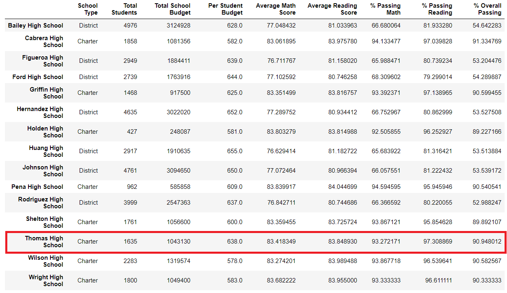
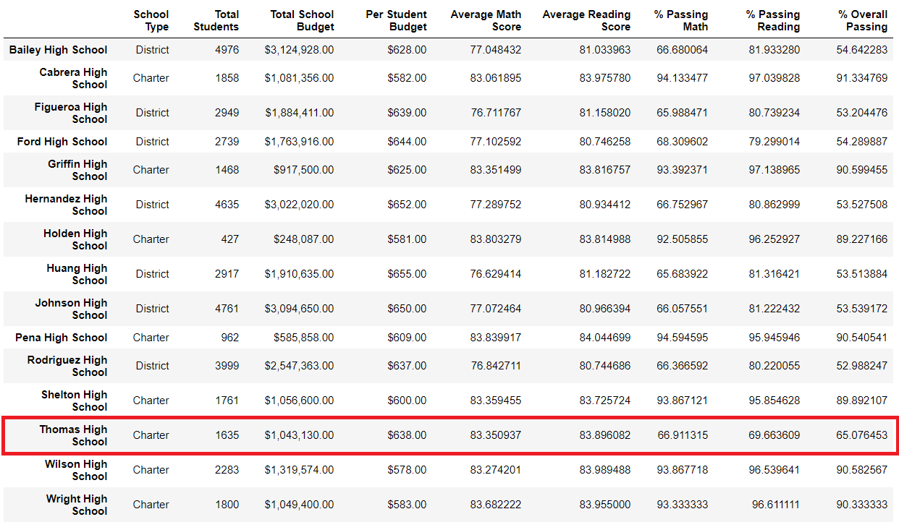

# School District Analysis
## Overview of the School District Analysis
Based on standarized math and reading tests results, we analyse the overall district's and schools' performance. Various statistical summaries are generated to show all the requested information. Given the fact that there is evidence of academic dishonesty; specifically in the reading and math grades for *Thomas High School* ninth graders (461 students, 1.2% of total students) we compare the results with and without those grades. It is important to highlight that since we are only setting as *null* the math and reading scores, the *Student ID* column is kept and therefore the amount of students in the school does not change.

## Results
When comparing the dataset with and without the *Thomas High School* ninth graders scores we get the following results:

### District Summary
We can see a small decrease of about a 1% in all scores when not considering *Thomas High School* 9th graders scores. This makes sense since it means that when we are no longer considering the altered scores, it goes down on the same amount, meaning that they are all above the mean as we can see in the table.

District Summary                               | Image
:---------------------------------------------:|:-------------------------------------:
District Summary Complete                      | 
District Sumary without 9th graders |  
*Thomas High School* 9th graders    |  

### School Summary
 
School Summary Complete                        | School Sumary without 9th graders
:---------------------------------------------:|:-------------------------------------:
     | 